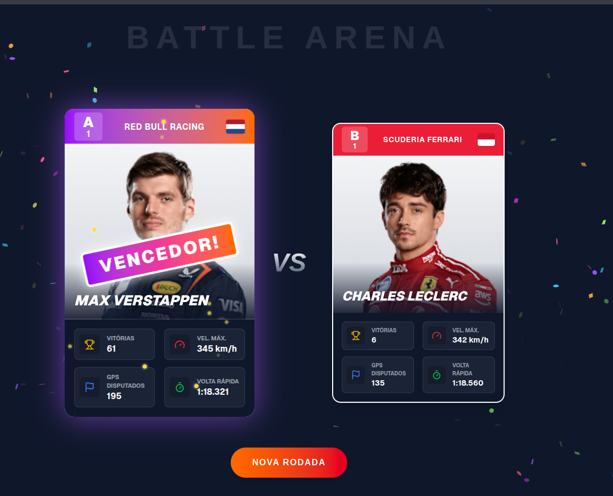

# 🏎️ F1 Super Trunfo - Battle Arena


Uma reinterpretação moderna e interativa do clássico jogo de cartas "Super Trunfo", focado no universo da Fórmula 1. Este projeto explora conceitos avançados de **Front-End**, **Arquitetura de Componentes** e **Gerenciamento de Estado** em Next.js.


*(Substitua este link por um print real da sua tela com o efeito de vitória)*

## 🚀 Funcionalidades

- **Modos de Jogo Múltiplos:** Suporte para **P1 vs. P2** e **Batalha Clássica (VS CPU)**.
- **Categorias Dinâmicas:** Jogue com cartas de **Pilotos** ou de **Fabricantes (Escuderias)**.
- **Lógica de Desempate:** Implementação da regra **Super Trunfo** e estado de **EMPATE** claro.
- **Feedback Visual Avançado:**
  - O atributo vencedor recebe uma **Seta Verde de Vantagem**.
  - O card vencedor recebe efeitos **Holográficos** e explosão de **Confetes**.
- **Arquitetura Híbrida de Dados:** Utiliza Server Components para carregar dados de APIs (Ergast/OpenF1) com fallback para dados locais.

## 🛠️ Tecnologias Utilizadas

- **Core:** [Next.js 14](https://nextjs.org/) (App Router, Server/Client Components)
- **Linguagem:** [TypeScript](https://www.typescriptlang.org/)
- **Estilização:** [Tailwind CSS](https://tailwindcss.com/)
- **Ícones:** [Lucide React](https://lucide.dev/) (Incluindo ArrowUp/ArrowDown para batalha)
- **Efeitos:** [Canvas Confetti](https://www.npmjs.com/package/canvas-confetti)

## 📂 Arquitetura do Projeto

O projeto segue princípios de **Clean Code** e **Separação de Responsabilidades**:

```bash
src/
├── app/
│   └── page.tsx           # Server Component que carrega dados e injeta no GameController
├── components/
│   ├── F1TrumpCard/       # Componentes de UI de Cartas
│   │   ├── index.tsx      # Card Principal (Montador, Agrega dados)
│   │   ├── StatItem.tsx   # Linha de Atributo (Lógica de clique e resultado visual)
│   │   └── CardBack.tsx
│   ├── ModeSelector.tsx   # Seleção de Modo (PVP vs. CPU)
│   └── TypeSelector.tsx   # Seleção de Categoria (Piloto vs. Fabricante)
├── data/
│   ├── drivers.ts         # Mock/Fallback de Pilotos
│   └── teams.ts           # Mock/Fallback de Fabricantes
├── hooks/
│   └── useConfetti.ts
└── lib/
    └── f1api.ts           # Lógica de fetch da API Híbrida (Ergast/OpenF1)